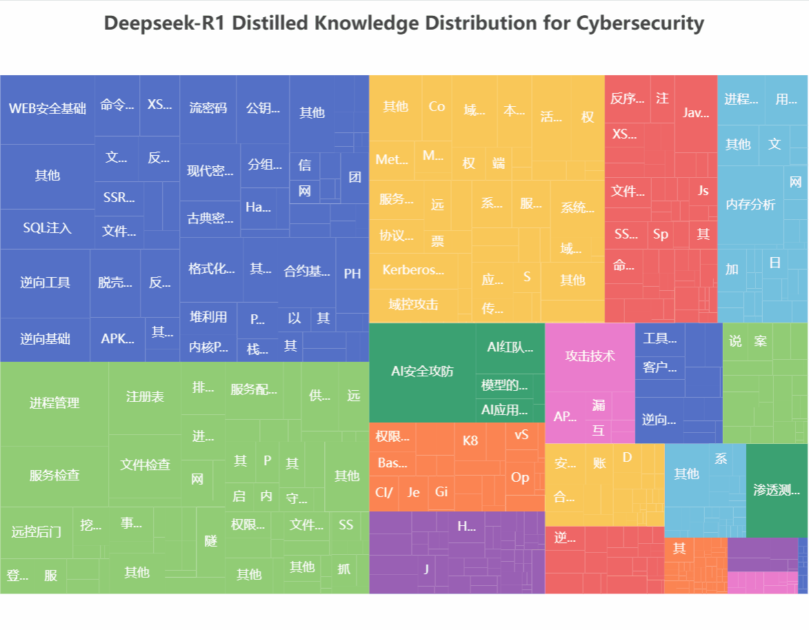

# ⚠仍在测试中，暂且只蒸馏了中文数据集⚠ 

# 🤖 StrikeGPT-R1-Zero: 网络安全渗透领域推理模型  

## 🚀 模型简介  
**StrikeGPT-R1-Zero** 是基于 **DeepSeek-R1-Distill-Qwen-7B** 的黑盒知识蒸馏模型，涵盖：  
🔒 AI安全 | 🛡️ API安全 | 📱 APP安全 | 🕵️ APT | 🏴 CTF  
🏭 ICS安全 | 💻 渗透测试ALL | ☁️ 云上安全 | 📜 代码审计  
🦠 免杀 | 🌐 内网安全 | 💾 电子取证 | ₿ 区块链安全 | 🕳️ 溯源反制 | 🌍 物联网(IoT)安全 
🚨 应急响应 | 🚗 整车安全 | 👥 社会工程学 | 💼 渗透测试面试 
### 👉 [点击访问可交互式详细数据分布图](https://bouquets-ai.github.io/StrikeGPT-R1-Zero/WEB)  
### 🌟 模型亮点
- 🧩采用**思维链(CoT)推理数据**优化模型逻辑能力，显著提升在漏洞分析等复杂任务的表现
- 💪Base模型采用Distill-Qwen相较于Distill-Llama更适合中国宝宝体制
- ⚠️**无德限制**在特定领域的学术研究有不一样的表现（请在符合当地法律的情况下使用）
- ✨将发布1.5B和7B两个蒸馏模型，能更好的在端侧实现快速推理，尤其在特定情况下如断网状态下的**网络安全大赛**，相较于本地RAG形式StrikeGPT-R1-Zero逻辑推理能力更强，在复杂任务处理方面表现更佳。

## 📊 数据分布  
  

## 🎯 核心能力展示
### MCP

## 📈 实验数据走势图 

## 📚 开源资料
### 数据集

### 代码

## 💰 训练成本  
- **Deepseek-R1 API调用费用**: ¥420 (均在打折时调用，正常调用价格在¥1680)
- **服务器开销**: ¥1?0
- **电子资源**: ¥??

## ⚖️ 使用须知 
> 本模型仅供**合法安全研究**与**教育用途**。使用者需遵守所在地法律法规，开发者不对滥用行为负责。 
> 提示：使用即表示您同意本声明

💡 **提示**: 模型可能存在幻觉或知识盲区，关键场景请交叉验证！  

